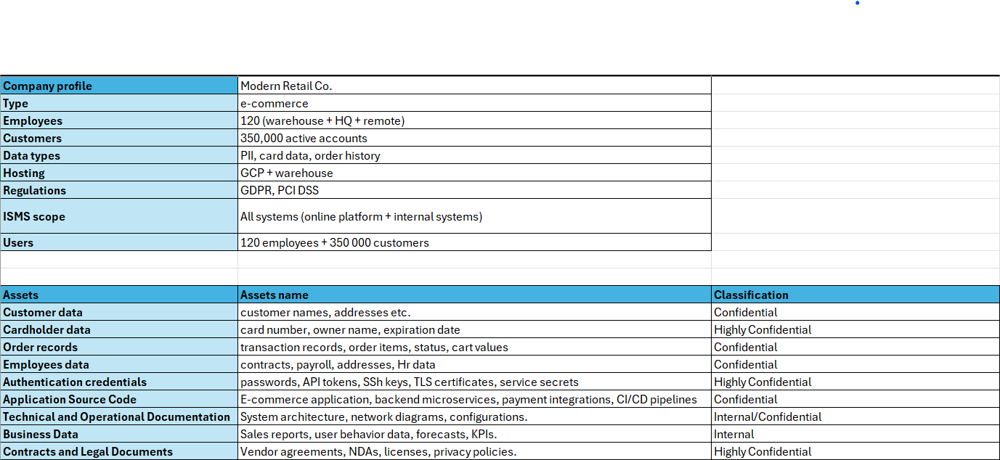
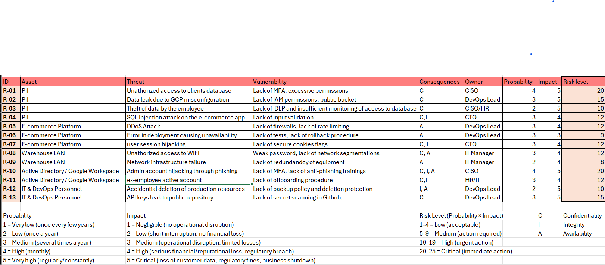
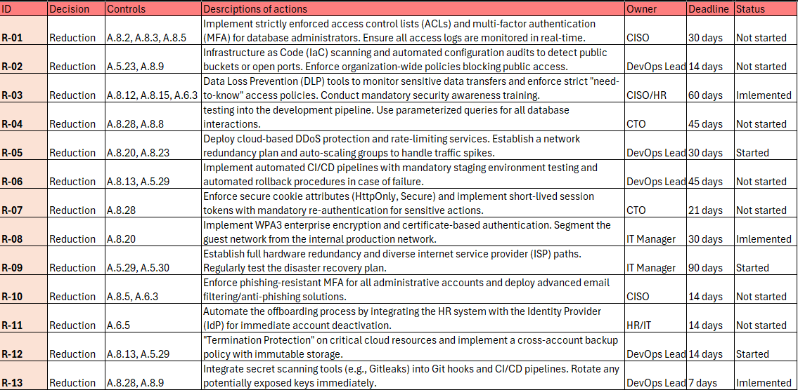
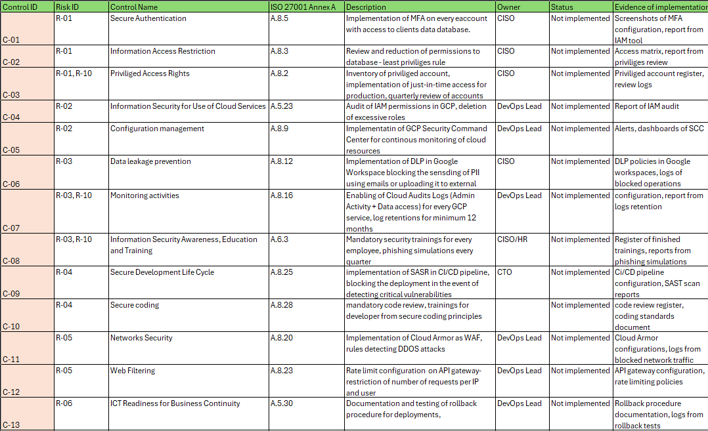
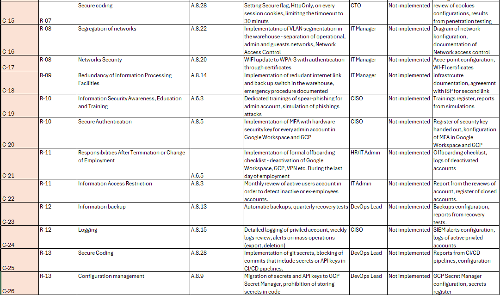
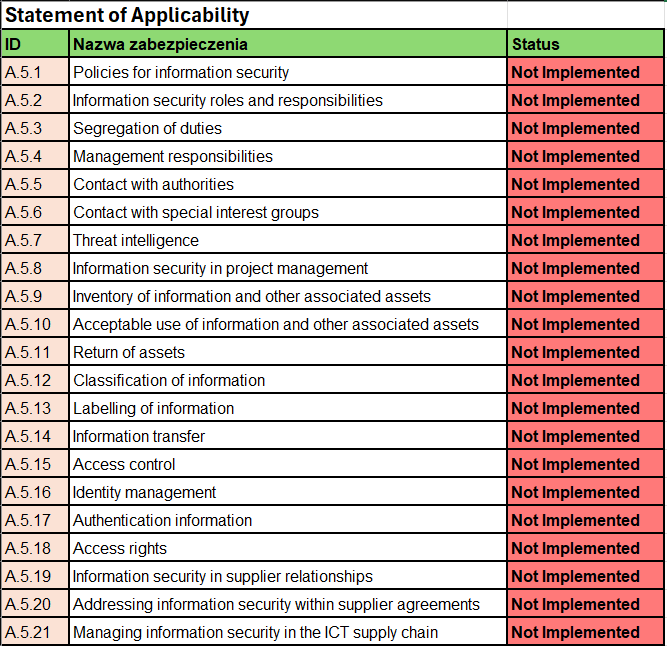
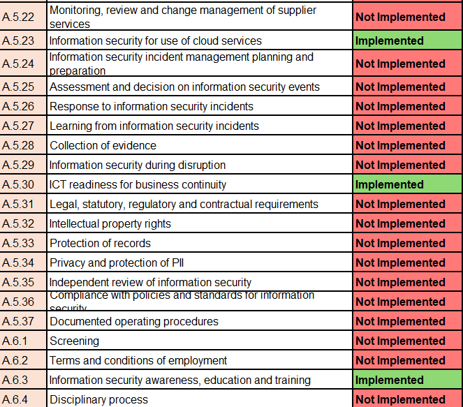
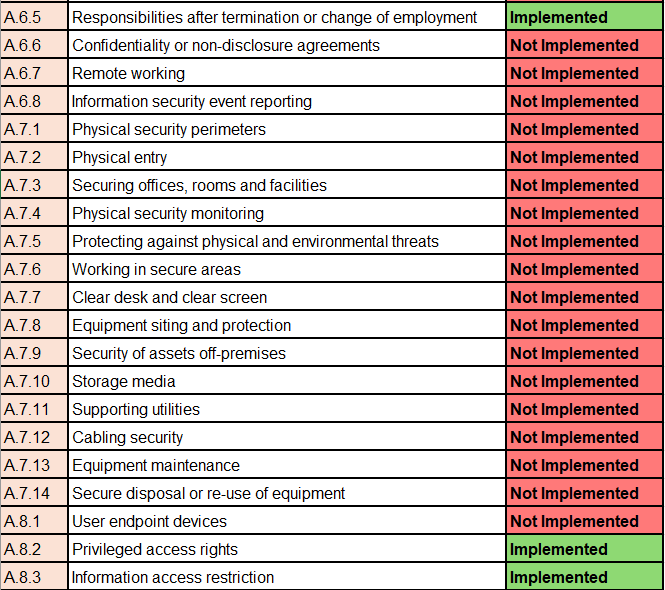
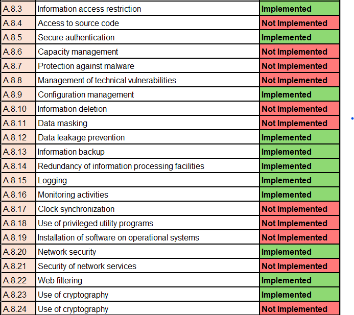

# Mini GRC Project
GRC Project to self-learn governance, security and compliance practices.

## About
This project implements an ISO/IEC 27001:2022 aligned GRC framework for Modern Retail Co., a fictional e-commerce platform. It consists of:

    Risk Register: Tracks assets, threats, and vulnerabilities. Also, it includes risk assessment based based on Impact and Probability.

    Risk Treatment Plan: Defines mitigation actions and assigns owners.

    Controls: Maps technical/organizational protections to risks (e.g., employee offboarding).

    Statement of Applicability (SoA): Formally documented the status (Implemented/Not Implemented) of all 93 Annex A controls.

Goal: To bridge the gap between risk management and audit readiness, showing exactly why and how controls are implemented.

---

## 1. Company Details
Modern Retail Co. is a fictional e-commerce company with 120 employees and 350,000 active customer accounts. Its core assets, hosted on Google Cloud Platform (GCP) and local warehouse infrastructure, include customer data, cardholder information, order records, and authentication credentials, all classified according to strict security levels from internal to highly confidential.

---

## 2. Risk Register
This section presents a Risk Register that evaluates potential threats to the company's assets, such as PII, the e-commerce platform, and network infrastructure. Each identified risk is assessed based on specific vulnerabilities, its impact on the CIA triad (Confidentiality, Integrity, Availability), and an assigned owner. By calculating risk levels as a product of probability and impact, the matrix categorizes findings from low to critical, serving as a foundational roadmap for prioritized security mitigation and remediation efforts.

---

## 3. Risk Treatment Plan
Following the risk assessment, this Risk Treatment Plan outlines the strategic decisions and technical controls deployed to mitigate each identified threat. Maping directly to standard security frameworks, the plan defines specific descriptions of actions—such as implementing multi-factor authentication (MFA), data loss prevention (DLP) tools, and automated CI/CD pipelines. Each mitigation task is assigned a dedicated owner, a strict implementation deadline, and an ongoing tracking status to ensure a structured and accountable approach to strengthening the organization's overall security posture.

---

## 4. Controls
This section details the Internal Security Controls Registry, which maps specific security measures (from C-01 to C-26) directly to the previously identified Risk IDs and ISO 27001 Annex A standards. It provides an operational breakdown of technical and administrative controls—ranging from secure authentication and network segmentation to secure coding practices and business continuity readiness. Crucially, each entry defines the technical description, the responsible owner, the current implementation status, and the precise evidence required (such as logs, configurations, and test reports) to verify and audit the control's effectiveness.

---

## 5. Statement of Applicability
This final section introduces the Statement of Applicability (SoA), a core component of the ISO 27001 framework that defines which information security controls are currently active within the organization. The matrix lists standard controls across key domains - including organizational, people, physical, and technological security - and explicitly states their deployment status. By clearly distinguishing between implemented measures (such as secure authentication, cloud services security, and network protection) and those not yet implemented, the SoA provides a transparent compliance baseline and highlights the precise areas targeted for future security maturity.

---

### LLet's connect! You can find me on:
[LinkedIn 🔗](https://www.linkedin.com/in/natalia-by%C4%87/)
